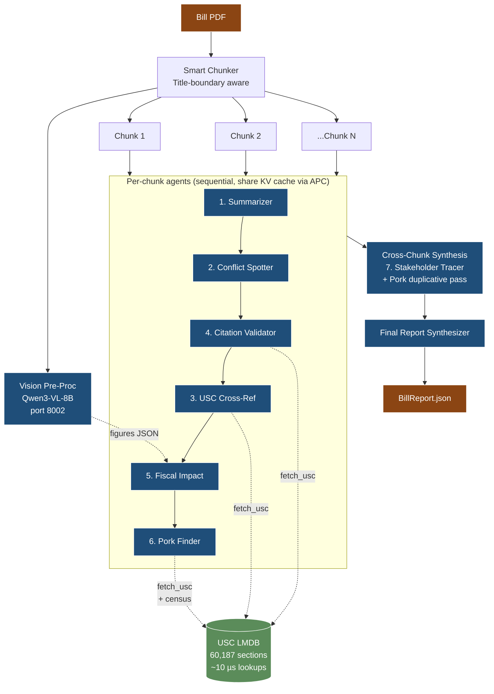

# AMD Hackathon — Bill Analyzer

Multi-agent legislative bill analyzer running on AMD MI300X (192 GB VRAM).

Submitted to the [lablab.ai AMD Developer Hackathon](https://lablab.ai/ai-hackathons/amd-developer), May 2026.

---

## What it does

Ingests a U.S. legislative bill PDF and produces a structured analysis: USC cross-references, fiscal impact, pork detection, stakeholder mapping, and citation validation. Runs end-to-end on a single MI300X GPU.

### Three demo bills, three regimes, one architecture

| Demo | Bill | Pages | Tokens | Chunks | Target FP8 time |
|---|---|---|---|---|---|
| Act I   | OBBB Act 2025 (HR 1, enacted Pub. L. 119-21) | 330   | ~125K  | 1 | <3 min |
| Act II  | Build Back Better Act 2021 (HR 5376)         | 2,469 | ~920K  | 4 | <8 min |
| Act III | FY24 NDAA (HR 2670)                          | 1,237 | ~460K  | 2 | <5 min |

Same architecture, no code changes between runs.

## Why MI300X

192 GB VRAM lets us run **three Qwen models concurrently** on a single GPU:

- **Qwen3-VL-8B-Thinking** (~8 GB FP8) — extracts charts/tables from the bill
- **Qwen3.6-35B-A3B** (~35 GB FP8) — long-context spine, holds 250K-token chunks
- **Qwen3-32B** (~64 GB BF16) — full-precision reasoner for citations + math

Combined with vLLM's Automatic Prefix Caching on ROCm, all per-chunk specialist agents share a single chunk's KV cache — turning what would be N expensive prefills on a 5090 into 1 prefill + (N-1) cache hits.

## Architecture



### Agent roster (MVP, 7 agents)

| # | Agent | Model | Tools | Stage |
|---|---|---|---|---|
| 1 | Plain-English Summarizer  | Qwen3.6 spine | — | per-chunk |
| 2 | Conflict Spotter          | Qwen3.6 spine | — | per-chunk |
| 3 | USC Cross-Reference       | Qwen3-32B     | `fetch_usc` | per-chunk |
| 4 | Citation Validator        | Qwen3.6 spine | `fetch_usc` | per-chunk |
| 5 | Fiscal Impact Estimator   | Qwen3-32B     | vision JSON | per-chunk |
| 6 | Pork Finder               | Qwen3-32B     | `fetch_usc`, `census_lookup` | per-chunk + cross-chunk pass |
| 7 | Stakeholder Tracer        | Qwen3-32B     | — | cross-chunk |
| — | Final Report Synthesizer  | Qwen3-32B     | — | finalize |

Stretch agents (re-introduced if MVP lands ahead of schedule): Definitions Extractor, Effective Date Tracker, Regulatory Authority Mapper, Risk Flagger, Constitutional / Preemption Analyst.

## VRAM budget

```
Qwen3-VL-8B-Thinking    (FP8) :  ~8 GB
Qwen3.6-35B-A3B          (FP8) : ~35 GB
KV cache @ 250K tokens   (FP16): ~38 GB
Qwen3-32B                (BF16): ~64 GB
─────────────────────────────────────────
Total                          : ~145 GB     (47 GB headroom on 192 GB)
```

## Quick start

```bash
# (filled in on Day 6)
./infra/one_click_run.sh path/to/bill.pdf
```

For development, individual subsystems can be exercised:

```bash
# Build USC LMDB locally (one-time, ~35 sec on 8-core box)
python infra/usc_corpus_build.py \
    --xml-dir   ./data/xml \
    --lmdb-path ./data/usc.lmdb \
    --release   119-36

# Launch the three Qwen endpoints on a fresh MI300X instance
./infra/vllm_serve.sh all

# Stop them
./infra/vllm_serve.sh stop
```

## Status

🚧 **In active development** — May 4–10, 2026.

Build progress is published in real time as Build-in-Public posts on X / LinkedIn under `#AMDDevHackathon`. Day-by-day execution plan and acceptance criteria are tracked in Notion.

### Day 0 — complete (May 3)

- Repo bootstrapped, MIT-licensed
- Three demo bill PDFs sourced (HR1 / BBB 2021 / FY24 NDAA)
- USC corpus built as LMDB: **60,187 sections** across all 58 USC titles, release point PL 119-36, **~10 µs hot-cache lookups**, 379 MB compact
- `infra/usc_corpus_build.py` shipped (Day 1 task pulled forward)
- `infra/vllm_serve.sh` shipped (Day 1 task pulled forward)

## License

MIT — see [LICENSE](./LICENSE).
